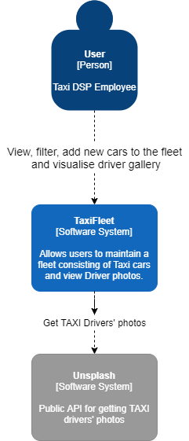
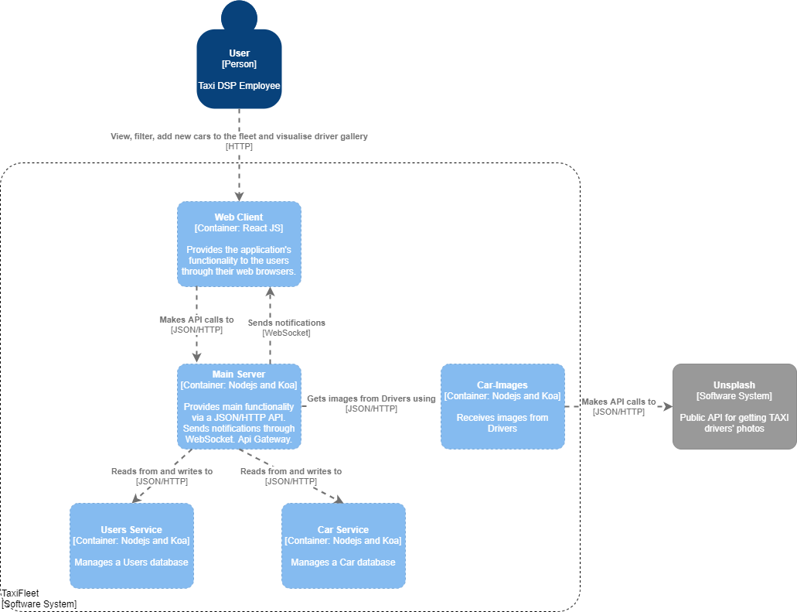
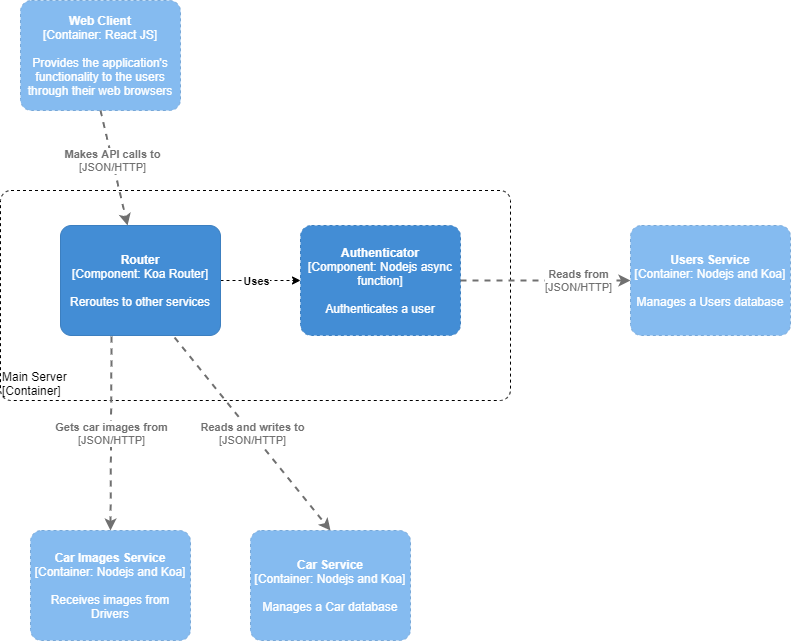

# TaxiFleet

TaxiFleet is a WebApplication that allows Taxi companies to manage their fleet of cars. 

The application offers two main pages:
- Homepage - contains a table that represents all the cars in the current database. Also allows for adding new cars to the fleet.
- Gallery - shows a random photo presumed to be taken by the drivers

A notification is send whenever a new car is added to the fleet.

# Installation
```
$ docker-compose up
```

# Architecture

## Context Diagram


## Container Diagram


## Component Diagram

- Focused on the Main Server


## Service-oriented Architecture Patterns

This application is composed of multiple Microservices patterns. 

Those are the following:
- Microservice architecture - architect an application as a collection of loosely coupled, services
- Database per Service - each service has its own private database
- Service instance per Container - deploy each service instance in its container
- API gateway - a service that provides each client with unified interface to services
- Access Token - a token that securely stores information about user that is exchanged between services